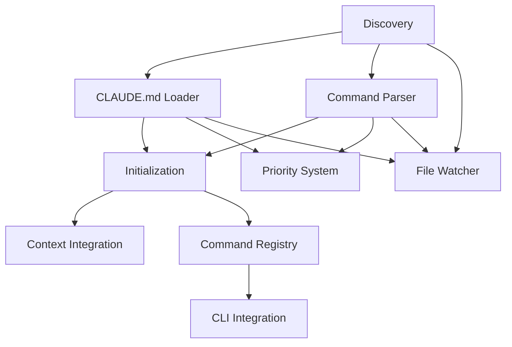

# Claude Configuration Implementation - PRP Summary

## Overview
Implementation plan for making auto-dev aware of and use .claude directories and their contents. This feature enables user customization through CLAUDE.md instructions and custom commands.

## Generated PRPs (11 total)

### Phase 1: Foundation (P1 - Must implement first)
1. **PRP-260: Claude Configuration Discovery** (2-3 hours)
   - Discovers .claude directories in project and home
   - Establishes base for all other components
   - Dependencies: None

2. **PRP-261: CLAUDE.md File Loader** (2 hours)
   - Loads and validates CLAUDE.md content
   - Dependencies: PRP-260

3. **PRP-262: Claude Command Parser** (3 hours)
   - Parses command files from .claude/commands/
   - Dependencies: PRP-260

4. **PRP-270: Claude Configuration Initialization** (2 hours)
   - Bootstrap and initialization sequence
   - Dependencies: PRP-260, 261, 262

### Phase 2: Integration (P2 - Core functionality)
5. **PRP-263: Claude Context Integration** (2-3 hours)
   - Integrates CLAUDE.md into ContextManager
   - Dependencies: PRP-261, PRP-270

6. **PRP-264: Claude Command Registry** (3 hours)
   - Central registry for discovered commands
   - Dependencies: PRP-262, PRP-270

7. **PRP-265: Claude Config Priority System** (2-3 hours)
   - Handles override and merge logic
   - Dependencies: PRP-260, PRP-261, PRP-262

8. **PRP-267: Claude CLI Integration** (3-4 hours)
   - Makes commands available in CLI
   - Dependencies: PRP-264

### Phase 3: Enhancement (P3 - Quality improvements)
9. **PRP-266: Claude Config File Watcher** (3 hours)
   - Hot-reload on configuration changes
   - Dependencies: PRP-260, PRP-261, PRP-262

10. **PRP-268: Claude Config Testing Framework** (2-3 hours)
    - Comprehensive testing infrastructure
    - Dependencies: All core PRPs

11. **PRP-269: Claude Config Documentation** (2 hours)
    - User documentation and examples
    - Dependencies: All PRPs

## Implementation Order



## Total Estimated Time
- Phase 1: 9-10 hours
- Phase 2: 10-13 hours
- Phase 3: 8-9 hours
- **Total: 27-32 hours**

## Key Integration Points

### With Existing Systems
1. **ContextManager** (llm/context_manager.rs)
   - Add CLAUDE.md as priority context
   
2. **FileWatcher** (monitor/watcher.rs)
   - Extend to watch .claude directories
   
3. **CLI Commands** (cli/commands/)
   - Dynamic command registration
   
4. **MCP Discovery** (mcp/discovery.rs)
   - Similar pattern for config discovery

### New Module Structure
```
auto-dev-core/src/claude/
├── mod.rs                    # Module exports
├── discovery.rs              # PRP-260
├── claude_md.rs             # PRP-261
├── command_parser.rs        # PRP-262
├── command_types.rs         # PRP-262
├── context_integration.rs  # PRP-263
├── command_registry.rs     # PRP-264
├── config_priority.rs      # PRP-265
├── config_merger.rs        # PRP-265
├── config_watcher.rs       # PRP-266
├── reload_handler.rs       # PRP-266
├── init.rs                 # PRP-270
├── test_fixtures.rs        # PRP-268
└── test_utils.rs           # PRP-268
```

## Success Metrics
- CLAUDE.md content appears in all LLM prompts
- Custom commands available in CLI
- Hot-reload works without restart
- Project configs override global configs
- Comprehensive test coverage (>90%)

## Risk Mitigation
- Each PRP is independently testable
- Graceful degradation if .claude missing
- No breaking changes to existing functionality
- Incremental implementation possible
- Clear rollback points between phases

## Confidence Score: 8/10
Well-scoped PRPs with clear dependencies and integration points. Main complexity in coordinating multiple components, but each PRP is focused and achievable.