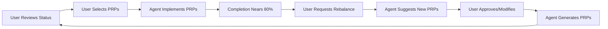

# PRP Rebalancing Strategy - 70% Equilibrium

**Date**: 2025-09-27  
**Current Status**: 28/40 PRPs Complete (70%)  
**Goal**: Maintain ~70% completion rate through controlled growth

## The 70% Equilibrium Principle

Maintaining a 70% completion rate creates a healthy development rhythm:
- **Momentum**: Always have achievements to celebrate
- **Vision**: Always have goals to pursue
- **Balance**: Neither overwhelming backlog nor empty pipeline
- **Growth**: Continuous system evolution

## Mathematical Model

```
If implementing N PRPs, add ceil(N * 0.43) new PRPs
Examples:
- Implement 5 PRPs → Add 3 new PRPs
- Implement 10 PRPs → Add 5 new PRPs
```

This maintains ~70% completion: `(28+N)/(40+N*0.43) ≈ 0.70`

## Human-in-the-Loop Process

### 1. **Review Phase** (User Decides)
Before each implementation sprint:
- User reviews active PRPs
- User selects which to implement
- User identifies gaps or needs
- User approves new PRP themes

### 2. **Generation Phase** (Collaborative)
When ready for new PRPs:
- User specifies focus areas
- Agent suggests PRP candidates
- User selects/modifies/rejects
- User and agent finalize together

### 3. **Execution Phase** (Agent Implements)
With user-selected PRPs:
- Agent implements approved PRPs
- Agent reports progress regularly
- Agent flags blockers for user input
- Agent completes with validation

## Current Rebalancing Needs

### If We Implement Next 5 PRPs:
- **New Total**: 33/40 (82.5% - too high!)
- **Needed**: Add 3 PRPs to maintain 70%
- **Result**: 33/43 (76.7% - acceptable range)

### Suggested Focus Areas for New PRPs:
User should choose which areas are of interest:

#### A. Performance & Optimization
- [ ] Memory-efficient build pipeline
- [ ] Response caching layer
- [ ] Incremental compilation cache
- [ ] Async task queue system

#### B. Developer Experience
- [ ] Interactive CLI mode (REPL)
- [ ] Configuration wizard
- [ ] Migration tool generator
- [ ] Better error messages

#### C. Quality & Testing
- [ ] Benchmark suite framework
- [ ] Fuzzing test harness
- [ ] Integration test expansion
- [ ] Performance regression detection

#### D. Observability
- [ ] Distributed tracing (OpenTelemetry)
- [ ] Health check dashboard
- [ ] Metrics aggregation
- [ ] Debug mode enhancements

#### E. Advanced Features
- [ ] Plugin marketplace client
- [ ] Real-time collaboration
- [ ] Distributed execution
- [ ] Advanced caching strategies

## User Input Needed

1. **Which active PRPs should agent implement next?**
   - High-priority ones user has identified
   - Or should agent continue with PRP-223 (CLI Generate)?

2. **Which focus areas for new PRPs interest the user?**
   - Select from A-E above
   - Or suggest other themes

3. **How many PRPs should be added now?**
   - Minimum 3 to maintain ratio
   - Could add more for buffer

4. **Any specific features needed?**
   - Business needs
   - Pain points to address
   - Interesting ideas to explore

## Proposed Workflow



## Benefits of User Control

1. **Alignment**: PRPs match actual project needs
2. **Priority**: User controls what gets built
3. **Quality**: User expertise guides selection
4. **Ownership**: User shapes project direction
5. **Flexibility**: Adapts to changing requirements

## Next Steps

User should indicate:
1. Should agent continue implementing current PRPs?
2. Which new PRP themes are of interest?
3. Any specific features to be added?
4. Preferred review frequency?

The goal is to maintain momentum while ensuring everything built serves the project vision for auto-dev-rs.

---

*Note: This strategy document will evolve based on user feedback and preferences.*
